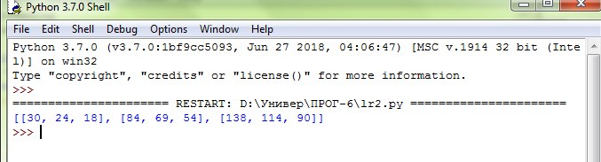

# sem6-lr2
Лабораторная работа 2. Перемножение матриц (numpy)
Реализуйте перемножение квадратных матриц произвольной размерности, используя библиотеку numpy (для создания матриц) и библиотеку threading (поточное вычисление).

После реализации вычисления, создайте 3-5 тестов для проверки корректности. (тестов нет)

